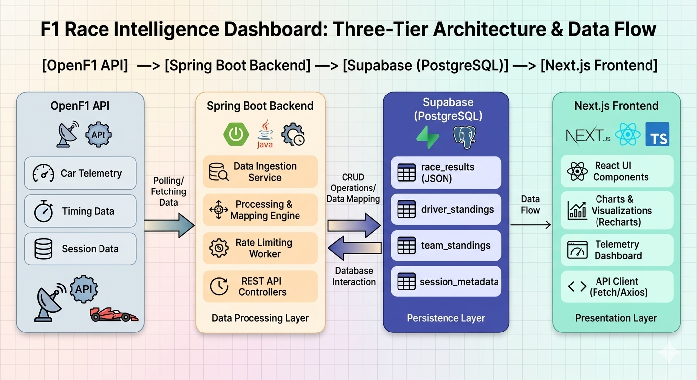

# 🏎️ F1 Race Intelligence Dashboard

A high-performance full-stack F1 analytics platform that visualizes real-time and historical Formula 1 data using the OpenF1 API and a persistent PostgreSQL backend.

## 🌐 Live Demo

[f1-race-intelligence-dashboard.vercel.app](https://f1-race-intelligence-dashboard.vercel.app/)

## 🚀 Tech Stack

- **Frontend**: Next.js (React, TypeScript, Tailwind CSS, Shadcn UI, Recharts)
- **Backend**: Spring Boot (Java, Spring Web, PostgreSQL/Supabase)
- **Data Source**: OpenF1 API

## 📊 Features

- **Historical Data Persistence**: Full-season backfilling with stateful storage in Supabase.
- **Live Telemetry & Tracking**: Real-time driver position and interval tracking.
- **Performance Analytics**: Comparative driver lap-time and stint analysis.
- **Standings Engine**: Backend-computed driver and constructor championship standings.
- **Interactive Data Visualization**: Dynamic charts for lap trends and championship battles.

## 🧠 Architecture & Data Flow

- **Ingestion Layer**: Spring Boot services poll, process, and normalize data from the OpenF1 API.
- **Persistence Layer**: Data is persisted in Supabase (PostgreSQL), ensuring historical data is always available without redundant API calls.
- **Presentation Layer**: Next.js consumes RESTful endpoints from Spring Boot, utilizing cached database records for low-latency dashboard rendering.

## 📦 Project Structure

- `/frontend`: Next.js dashboard application, UI components, and API service layer.
- `/backend`: Spring Boot application, data models, processing logic, and REST controllers.

## 🗺️ Roadmap & Status

- **✅ Phase 1: Frontend Dashboard UI** – Component architecture, mock data simulation, and responsive layout.
- **✅ Phase 2: Backend Development** – OpenF1 integration, in-memory data processing, and REST endpoints.
- **✅ Phase 3: Full-Stack Integration** – Connected Next.js to Spring Boot, added state management, and handled loading states.
- **✅ Phase 4: Persistent Data Layer** – Migration to Supabase/PostgreSQL for historical data storage.
- **🔄 Phase 5: Advanced Features (In Progress)** – Driver profile pages and historical post-race tyre strategy visualizers.

⚙️ <b>Local Development Setup</b> (Click to expand)

### Backend Setup

1. Navigate to `/backend`
2. Create a .env file (or set these as system environment variables):
- SUPABASE_URL=your_db_url
- SUPABASE_USERNAME=your_username
- SUPABASE_PASSWORD=your_password
- SPRING_PROFILES_ACTIVE=dev
3. Run `./mvnw spring-boot:run` to start the server on port `8080`

### Frontend Setup

1. Navigate to `/frontend`
2. Create a .env.local file with the following:
- NEXT_PUBLIC_API_URL=http://localhost:8080
- NEXT_PUBLIC_SUPABASE_URL=your_supabase_url
- NEXT_PUBLIC_SUPABASE_ANON_KEY=your_supabase_key
3. Run `npm install` followed by `npm run dev`

 

⚠️ <b>System Constraints & Resiliency</b> (Click to expand)

### 🛰️ Upstream API Access (OpenF1)

- **Behavior**: During live Formula 1 race sessions, the public OpenF1 API rate-limits historical queries and restricts unauthenticated global access.
- **Mitigation**: The backend utilizes Supabase (PostgreSQL) as a persistent cache. By storing and processing data asynchronously, the dashboard serves historical results instantly from the database without repeated, latency-heavy calls to the upstream API.

### 🐢 Infrastructure Latency & Background Workers (Free-Tier Hosting)

* **Backend Cold Starts:** Hosted on Render's free tier. Inactivity triggers a spun-down container state. The initial API request may encounter a **5–10 second delay** while the service wakes up.
* **Frontend Performance:** Hosted on Vercel. Global delivery is highly optimized, though data-dependent components rely on the backend wake-up cycle.
* **Cron/Automation Workarounds:** Render's free tier disables native persistent background workers and `@Scheduled` tasks when the instance spins down. To circumvent this constraint, an external webhook router (**cron-job.org**) is configured to trigger specific Spring Boot ingest endpoints every weekend for a 5-hour active window during Grand Prix sessions, keeping the instance awake and ensuring consistent database backfilling.

